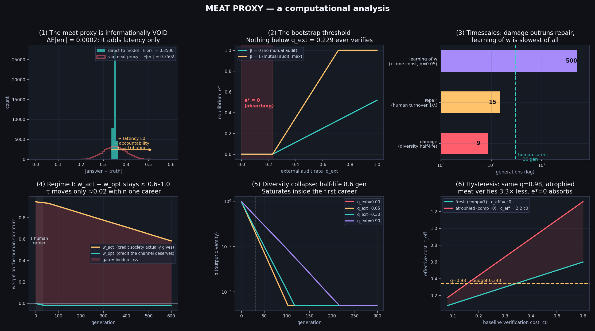
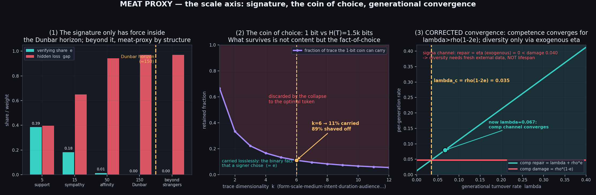
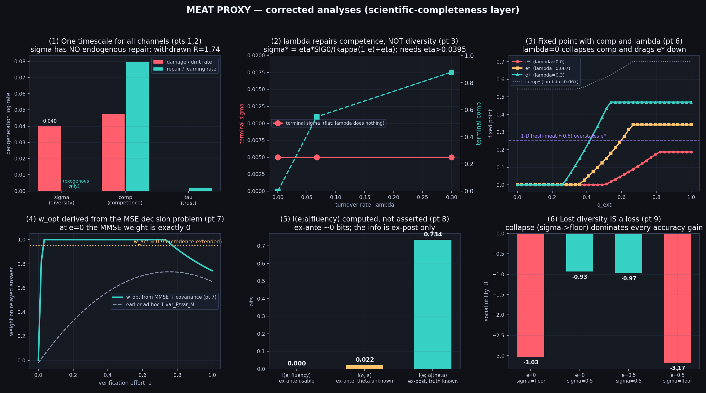

# meat-proxy

**ミートプロキシ（= AI の出力を検証せず中継する人間）を、吸収状態を持つ力学系として建模し、
その破綻点・重み・署名の効力範囲を演算で出すリポジトリ。**

思考実験ではなく力学系として扱います。語の自己矛盾（「検証しない検証者」）が
そのまま `e*=0` の吸収状態として現れ、破綻は単一の閾値ではなく
**損傷 / 修復 / 学習の三つの時定数の大小関係**として決まります。

詳細な導出と解釈は [`docs/ANALYSIS.md`](docs/ANALYSIS.md)、査読12点への対応と撤回記録は [`docs/ADDENDUM.md`](docs/ADDENDUM.md) にあります。

---

## Headline results

| # | 結果 | 値 |
|---|---|---|
| 1 | 肉の情報的付加価値（直接モデルに聞く系との差分） | `ΔE\|err\| = 0.0002`（= 0、遅延のみ付加） |
| 2 | 検証努力 `e*=0` は吸収状態（ヒステリシス比） | 同一監査 `q=0.98` で萎縮肉 0.153 vs 新品 0.512（**3.35×**） |
| 3 | チャネル別レート(/世代) σ損傷/σ修復/comp損傷/comp修復/τ学習 | **0.040 / 0(外生のみ) / 0.047 / 0.080 / 0.002** → σは内因修復なし・compは収束・τが最遅 |
| 4 | 内部是正の不可能性（相互監査の臨界） | `β_crit = 1.49 > 1`（物理上限 1）→ 内側に tipping point なし |
| 5 | 重みの誤配（体制I, `q_ext=0.05`） | `w_opt ≈ -0.02` vs `w_act ≈ 0.95` → `gap ≈ 0.65–0.97` が恒久固定 |
| 6 | 署名の効力範囲（ダンバー地平） | 地平内 `gap=0.40` → 地平外 `gap=0.97`（外側は構造としてミートプロキシ） |
| 7 | 選択のコイン（1 bit）が運べる痕跡の割合 | `k=6` で **11%**（89% は削ぎ落としで棄損。無損失で残るのは「選んだ事実 = `e`」） |
| 8 | 世代収束の条件 | comp: `λ > ρ(1−2e)=0.035`（現在 0.067 で収束）。σ: `η > κ(1−e)=0.040` が必要（λは無効） |
| 9 | `I(e;a｜fluency)` を実測 | **0.0001 bit**（事前 `I(e;a)=0.022`／事後 `I(e;a｜θ)=0.734`） |
| 10 | `w_opt` を MMSE+共分散から導出 | `e=0` で **ちょうど 0**（中継答は直接照会に厳密に劣る） |

---

## Figures

### 時間軸 — 等価性・ブートストラップ・時定数・重み・崩壊・ヒステリシス


### スケール軸 — 署名の効力範囲・選択のコイン・世代収束


### 補正軸 — 同一尺度のレート・λ↛σの実証・2D不動点・MMSE重み・実測MI・多様性を損失とする効用


> **選択のコイン（S2）の rate-distortion 部分は比喩的応用です**（点11）。痕跡は厳密にはガウス源ではなく、1bit コインは概念的なものです。

---

## Quickstart

```bash
python3 -m venv .venv && source .venv/bin/activate
pip install -r requirements.txt

make figures      # = python3 src/model.py && python3 src/figure_time.py && python3 src/figure_scale.py
```

生成物: `figures/*.png`, `results/*.json`

---

## Repository layout

```
.
├── README.md                  ← このファイル
├── docs/
│   └── ANALYSIS.md            ← 全文（導出・解釈・付録:スケール軸）
├── src/
│   ├── model.py               ← 力学系本体（個体群・内生監査・不動点）
│   ├── figure_time.py         ← 時間軸の集計と6面図
│   ├── figure_scale.py        ← スケール軸の集計と3面図
│   └── rigor.py               ← 科学的完成度レイヤ(補正・MI・MMSE・感度・multiseed)
├── figures/
│   ├── fig_time_axis.png
│   ├── fig_scale_axis.png
│   └── fig_rigor.png
├── results/
│   ├── sim_raw.json           ←  raw 軌道
│   ├── summary_time.json      ← 時間軸の集計
│   ├── summary_scale.json     ← スケール軸の集計
│   └── rigor.json             ← 補正解析の集計
├── tests/
│   └── test_rigor.py          ← 12不変テスト (pytest)
├── .github/workflows/ci.yml   ← CI (py3.11/3.12, pytest + 図再生成)
├── Makefile
├── requirements.txt
└── LICENSE
```

---

## Model in one screen

主体は `M`(モデル) / `P_i`(プロキシ=肉) / `S`(社会)。

```
m   = theta + B + eps                     # モデル出力。B=流暢さと無関係なバイアス
a   = (1-e)*m + e*theta + nu_r + e*nu_v   # 提示される答え。e=検証努力
e   = 1{ q*Φ*B > c0*(1+Γ(1-comp)) }       # 検証は bang-bang
comp← comp + ρ(e-comp)                    # 使わない検証力は萎縮
sig ← sig*(1-κ(1-e_bar))                  # 未検証出力の自己摂取が多様性を殺す
q   = q_ext + β*e_bar                     # 監査は内生（=「誰かが読む」= e の別名）
tau ← tau + DTAU*q*(0.5-bad)*2            # 社会の信頼の学習速度は監査頻度に比例
w_opt = 1 - var_P/var_M ;  w_act = tau*fluency ;  gap = w_act - w_opt
```

パラメータ表と命題 P1–P7 は [`src/model.py`](src/model.py) の docstring と
[`docs/ANALYSIS.md`](docs/ANALYSIS.md) を参照。

---

## Note on scope

数値はすべて**このモデルの既定パラメータ下でのもの**です。実世界の実測値ではなく、
「もしミートプロキシをこの力学系として読むなら、破綻点はここに出る」という条件付きの主張です。
パラメータを変えて感度を見ることは意図された使い方の一つです。

## License

MIT — see [LICENSE](LICENSE).
